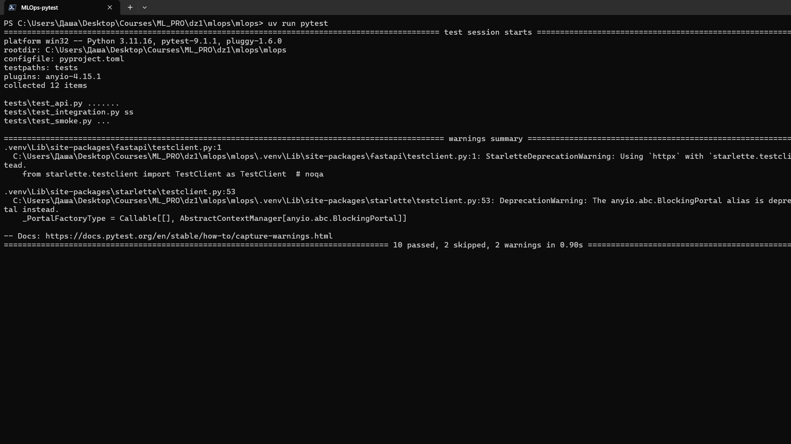
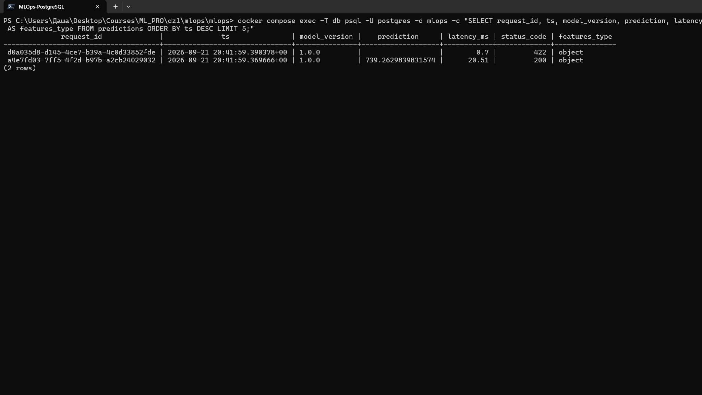
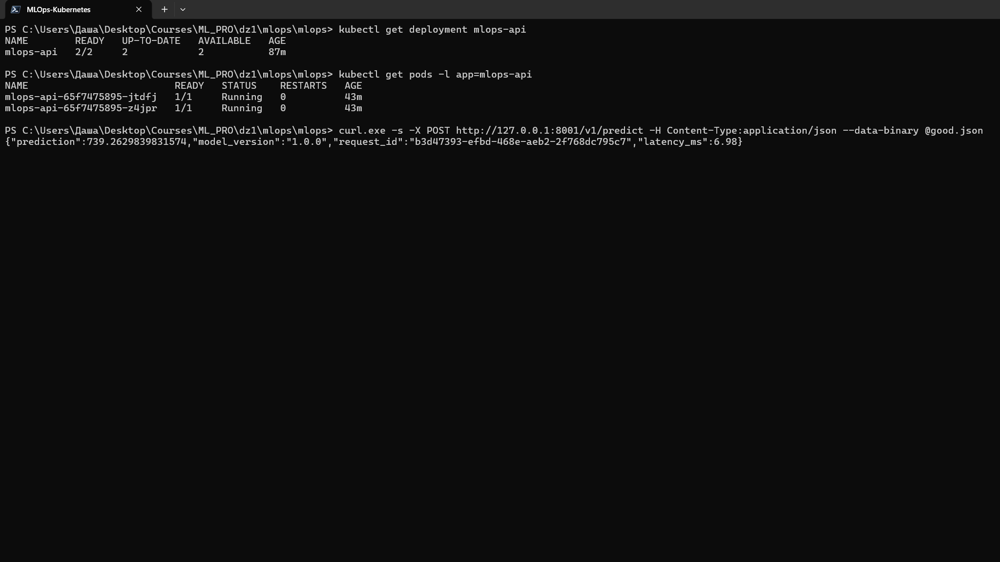
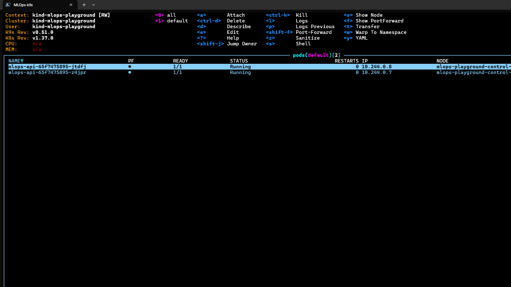

# MLOps Playground

Репозиторий: [github.com/dbelogortseva/mlops](https://github.com/dbelogortseva/mlops)

## Проверка

Команды выполняются из корня репозитория в PowerShell. Требуются `uv`, Docker, `kind` и `kubectl`.

```powershell
uv run pytest
docker compose up -d --build
if (-not ((kind get clusters) -contains "mlops-playground")) { kind create cluster --name mlops-playground }; kind load docker-image mlops-playground:1.0 --name mlops-playground; kubectl apply -f k8s; kubectl rollout status deployment/mlops-api --timeout=120s
```

## Результаты

### Тесты



### Логи запросов в PostgreSQL



### Kubernetes и ответ модели



### Поды в k9s



## Журнал проблем

1. Импорт пакета завершался ошибкой `ModuleNotFoundError: No module named 'mlops_playground'`. Причиной была несинхронизированная среда и неверная структура проекта. После настройки src-layout и синхронизации через uv импорт прошёл успешно.
2. Git сообщал `fatal: pathspec 'src/mlops_playground/api.py' did not match any files`. Команда выполнялась не из каталога репозитория. После перехода в правильный каталог пути стали доступны.
3. `kind` не находился в `PATH`: `kind: The term 'kind' is not recognized`. Для проверки использован официальный исполняемый файл kind, после чего образ был загружен в кластер и rollout завершился успешно.
4. Установка k9s через Chocolatey завершилась ошибкой `Unable to obtain lock file access ... kubernetes-cli`. Для скриншота использован официальный portable-архив k9s. Оба пода отображаются в состоянии `Running`.
